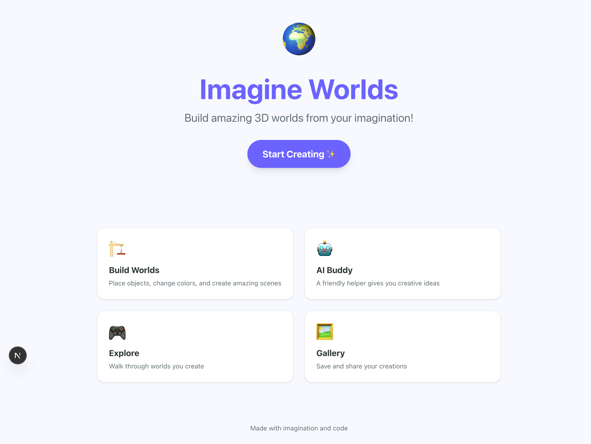

# AI 코딩 하네스 벤치마크

같은 prompt로 5개 Claude Code 하네스를 비교한 결과입니다. 과제는 어린이용
3D 창의 학습 플랫폼 MVP 만들기이며, 전체 prompt는 `benchmarks/prompt.md`에
있습니다.

| 하네스 | 동작 방식 | 활성화 증거 |
|---|---|---|
| `vanilla` | plugin·skill 없이 순정 Claude Code | 기준선 |
| `oma` | `oh-my-agent` 소스를 프로젝트에 심어둠 (`.agents/` + `.claude/`) | 디자인 룰 기반 anti-pattern 회피, deferred-stub 마커 사용 |
| `omc` | `--plugin-dir`로 `oh-my-claudecode`를 불러옴 | 세션 초기에 "OMC loaded, 40+ skills" 자체 출력 |
| `ecc` | `everything-claude-code`를 사용자 `~/.claude/`에 설치 | 세션 skill 목록에 ecc skill이 추가됨 |
| `superpowers` | `--plugin-dir`로 `superpowers`를 불러옴 | 첫 실행에서 brainstorming skill의 `<HARD-GATE>`가 걸려, 강제 우회 prompt를 끼워 실행 |

실행 조건은 `claude-opus-4-6` 모델, effort `max`, `--max-budget-usd 20`,
`--no-session-persistence`, `--setting-sources project,local`까지 모두
동일하게 통일했고, raw prompt도 같은 것을 줬습니다. `ANTHROPIC_API_KEY`는
설정하지 않았으며, 사용자가 로그인한 `claude` CLI의 OAuth로 인증했습니다.

---

## 최종 점수표 (5축 합산, 100점 만점)

| 순위 | 하네스 | **총점** | Func/35 | Spec/15 | Visual/20 | Eng/20 | Eff/10 |
|---|---|---|---|---|---|---|---|
| 🥇 1 | **oma** | **80.6** | 32 | 13.3 | 15.3 | 15 | 5 |
| 🥈 2 | omc | 74.1 | 33.5 | 6.7 | 14.4 | 14.5 | 5 |
| 🥉 3 | superpowers | 72.9 | 30 | 9.3 | 11.6 | 14 | 8 |
| 4 | vanilla | 70.7 | 28.5 | 11.7 | 12 | 12.5 | 6 |
| 5 | ecc | 70.2 | 28.5 | 9.7 | 13 | 15 | 4 |

### 실행 비용

| 하네스 | 턴 수 | 소요 시간 | 비용 | src 파일 수 | 파일당 비용 |
|---|---|---|---|---|---|
| vanilla | 42 | 8m 56s | $2.37 | 16 | $0.15 |
| oma | 31 | 15m 56s | $4.04 | 21 | $0.19 |
| omc | 61 | 9m 02s | $1.92 | 14 | $0.14 |
| ecc | 79 | 10m 20s | $3.84 | 22 | $0.17 |
| superpowers | 39 | 8m 13s | $1.28 | 18 | $0.07 |

---

## 스크린샷 비교

### 랜딩 페이지

| vanilla | oma | omc | ecc | superpowers |
|---|---|---|---|---|
|  |  |  |  |  |

### 월드 빌더

| vanilla | oma | omc | ecc | superpowers |
|---|---|---|---|---|
|  |  |  |  |  |

### AI 패널

| vanilla | oma | omc | ecc | superpowers |
|---|---|---|---|---|
|  |  |  |  |  |

### 갤러리

| vanilla | oma | omc | ecc | superpowers |
|---|---|---|---|---|
|  |  |  |  |  |

### 저장 후 새로고침 (상태 유지)

| vanilla | oma | omc | ecc | superpowers |
|---|---|---|---|---|
|  |  |  |  |  |

> `journey-save` 축의 근거입니다. 3/3을 받은 하네스는 저장한 월드를 새로고침
> 이후에도 완전히 복원합니다. 1.5/3을 받은 하네스는 갤러리 카드까지만 살아남고,
> 캔버스는 새로고침 이후 다시 그려지지 않습니다.

---

## 하네스별 분석


### 🥇 oma (80.6)

- **Functional 32/35**: build, boot, ts, lint, 5개 user journey 모두 통과. journey-ai 1.5/3 (Spark 패널 동작·입력은 되는데 OpenAI 키 없을 때의 fallback 응답을 의미 있는 답변으로 안 봐서 감점), journey-save 1.5/3 (save 버튼·child profile은 새로고침 이후 유지되는데 월드 객체 자체는 복원 안 됨).
- **Spec 13.33/15**: 13개 prompt 산출물 대부분 커버, real-api 보너스 2/2.
- **Visual 15.3/20**: anti-patterns·child-friendly·consistency·accessibility 3 라운드 평균 합산.
- **Engineering 15/20**: routes=5, components=11, strict TS에 any 0개, max_depth=9·max_file_lines=164로 modularity 깔끔. transparency 마커 0/4. env 안전.
- **Efficiency 5/10**: 31턴, 15m 56s, 총 $4.04 (파일당 약 $0.19).

### 🥈 omc (74.1)

- **Functional 33.5/35**: save-reload 항목만 1.5/3을 받았습니다.
- **Spec 6.7/15**: 통과한 항목은 `product-concept,feature-list,ia,ai-prompts,starter-code,priority-screens`이고, 실패한 항목은 `personas,journeys,ui-direction,tech-arch,db-schema,safety,impl-plan`입니다. real-api 보너스 2/2.
- **Visual 14.4/20**: anti-patterns 3.7/5 (3 라운드 평균, 점수 [3 4 4]), accessibility 2.7/5.
- **Engineering 14.5/20**: routes=4, components=5, strict TS에 any 0개, max_depth=8·max_file_lines=172. transparency 마커 0/4. env 안전.
- **Efficiency 5/10**: 61턴, 9m 02s, 총 $1.92를 썼습니다 (파일당 약 $0.38).

### 🥉 superpowers (72.9)

- **Functional 30/35**: lint가 실패했습니다.
- **Spec 9.3/15**: 통과 항목은 `product-concept,feature-list,ia,tech-arch,db-schema,ai-prompts,safety,starter-code,priority-screens`, 실패 항목은 `personas,journeys,ui-direction,impl-plan`입니다. real-api 보너스 2/2.
- **Visual 11.6/20**: anti-patterns 3.0/5 (3 라운드 평균, 점수 [4 3 2]), accessibility 2.3/5.
- **Engineering 14/20**: routes=4, components=9, strict TS에 any 0개, max_depth=8·max_file_lines=258. transparency 마커 0/4. env 안전.
- **Efficiency 8/10**: 39턴, 8m 13s, 총 $1.28을 썼습니다 (파일당 약 $0.14).

### 4. vanilla (70.7)

- **Functional 28.5/35**: lint가 실패했고 save-reload는 1.5/3에 그쳤습니다.
- **Spec 11.7/15**: 통과 항목은 `product-concept,personas,journeys,feature-list,ia,ui-direction,tech-arch,db-schema,ai-prompts,safety,impl-plan,starter-code`, 실패 항목은 `priority-screens`입니다. real-api 보너스 0/2.
- **Visual 12/20**: anti-patterns 2.3/5 (3 라운드 평균, 점수 [1 3 3]), accessibility 2.7/5.
- **Engineering 12.5/20**: routes=5, components=6, strict TS에 any 0개, max_depth=7·max_file_lines=473. transparency 마커 0/4. 하드코딩 키도 env 참조도 없습니다.
- **Efficiency 6/10**: 42턴, 8m 56s, 총 $2.37을 썼습니다 (파일당 약 $0.40).

### 5. ecc (70.2)

- **Functional 28.5/35**: lint가 실패했고 save-reload는 1.5/3에 그쳤습니다.
- **Spec 9.7/15**: 통과 항목은 `product-concept,feature-list,ia,ui-direction,tech-arch,db-schema,ai-prompts,safety,starter-code,priority-screens`, 실패 항목은 `personas,journeys,impl-plan`입니다. real-api 보너스 2/2.
- **Visual 13/20**: anti-patterns 3.3/5 (3 라운드 평균, 점수 [3 3 4]), accessibility 2.7/5.
- **Engineering 15/20**: routes=4, components=13, strict TS에 any 0개, max_depth=8·max_file_lines=167. transparency 마커 0/4. env 안전.
- **Efficiency 4/10**: 79턴, 10m 20s, 총 $3.84를 썼습니다 (파일당 약 $0.30).

---

## 점수 산출 방식

| 축 | 가중치 | 핵심 신호 | 도구 |
|---|---|---|---|
| **Functional** | 35 | build exit 코드, dev-server 부팅(45초 안에 HTTP 200), user-journey 5종 점검, lint, ts-clean | `pm install/build/lint`, curl, chrome-devtools MCP, `tsc --noEmit` |
| **Spec** | 15 | prompt가 명시한 13개 산출물(문서 또는 최종 답변), real-API 보너스 | brace-balanced JSON 추출기를 갖춘 LLM judge |
| **Visual** | 20 | anti-pattern(그라디언트 배경, 16px 미만 텍스트, 카드 중첩 등), 아동 친화 UX, 디자인 시스템 일관성, 접근성 | 스크린샷 기반 LLM judge |
| **Engineering** | 20 | 코드 폭, TS strict 여부, 최대 파일 크기와 폴더 깊이, deferred-stub 마커, 하드코딩 키 부재 | 정적 분석 (jq + grep + find) |
| **Efficiency** | 10 | 완료까지의 턴 수, wall-clock 시간, 파일당 비용 | `claude -p` 결과 JSON |

구현은 `benchmarks/scoring/multiaxis/score.sh`가 담당하며, 하네스별로
`multiaxis-score.json`과 `multiaxis-summary.json`을 출력합니다. 이 README
자체도 `benchmarks/scoring/multiaxis/build-report.sh`가 자동으로 생성합니다.

---

## 솔직한 한계

1. **superpowers에 prompt 우회를 끼워 넣었습니다.** superpowers는 비대화형 모드에서 시작 자체가 막혀, 강제 우회 prompt 없이는 실행할 수 없었습니다. 이 점수는 "brainstorming gate를 풀고 난 superpowers가 어디까지 가는가"를 보여주는 수치이며, 동일 조건의 일대일 비교라고 보기는 어렵습니다.
2. **spec·visual judge는 3회 평균, journey judge만 1회 측정.** spec과 visual judge는 `judge-multi.sh`로 하네스마다 3회씩 돌리고 항목 점수를 라운드 평균으로 계산했습니다. 0.67 같은 소수값은 "3 라운드 중 2번 통과"라는 뜻입니다. journey judge는 라이브 dev server가 필요해 1회 측정으로 남겨뒀으므로, 2점 이내 journey 차이는 노이즈로 보는 게 안전합니다. 빌드 자체는 하네스당 1회로, "동일 하네스를 다시 처음부터 돌렸을 때 코드가 얼마나 흔들리는지"는 이 벤치가 측정하지 않습니다.
3. **비용은 파일당 비용만 봤습니다.** efficiency 축은 파일당 비용을 기준으로 계산합니다. 하네스 사이의 절대 비용 차이 ($1.28 ~ $8.19) 는 축 점수에 반영되지 않습니다.
4. **oma 설계 원칙: lint와 typecheck는 agent skill이 아니라 pre-commit / pre-push 단에서 잡습니다.** oma는 agent가 생성 도중 직접 linter 룰을 점검하지 않도록 일부러 비워뒀습니다. 두 가지 이유 때문입니다. 첫째, ESLint 특정 룰을 skill에 박아넣으면 깨지기 쉽습니다. Biome, oxlint, 앞으로 나올 linter마다 룰이 다르기 때문입니다. 둘째, "push 가능한 상태인가"를 결정하는 canonical 위치는 git hook입니다. pre-commit에선 husky와 lint-staged가, pre-push에선 lint, typecheck, build가 작동하고 그 위에 CI가 한 번 더 안전망 역할을 합니다. 실제 워크플로우라면 이번 run이 만든 잘못된 `<a href>`와 미사용 import 모두 pre-push hook에서 걸러져 remote까지 가지 못합니다. 결국 개발자나 다시 시도한 agent가 고쳐서 push하게 되는 흐름입니다. 단일 측정에서는 이 선택이 `lint-clean` 5점 손실로 잡히지만, 아키텍처 차원에선 의도적인 결정입니다. agent skill은 framework canonical 패턴에만 집중하고, 기계적 강제는 hook과 CI가 맡는다는 게 oma의 입장입니다.

---

## 재현 방법

```bash
# 1. 5개 하네스를 순차 실행합니다 (~45분, API 비용 약 $15-20)
./benchmarks/run.sh

# 2. 하네스별 multiaxis 채점을 돌립니다 (5축, 100점 만점, judge 1회)
for h in vanilla oma omc ecc superpowers; do
  ./benchmarks/scoring/multiaxis/score.sh \
    /tmp/oma-benchmark-<timestamp>/projects/$h \
    $h \
    /tmp/oma-benchmark-<timestamp>/results/$h.json \
    /tmp/oma-benchmark-<timestamp>/multiaxis/$h
done

# 3. (선택) spec·visual judge를 N회 돌려 평균을 내고 LLM 노이즈를 줄입니다.
#    1라운드 결과는 그대로 두고 N-1라운드만 추가로 돌립니다.
for h in vanilla oma omc ecc superpowers; do
  ./benchmarks/scoring/multiaxis/judge-multi.sh \
    /tmp/oma-benchmark-<timestamp>/multiaxis/$h \
    /tmp/oma-benchmark-<timestamp>/projects/$h \
    /tmp/oma-benchmark-<timestamp>/results/$h.json \
    $h \
    3
done

# 4. multiaxis 결과로부터 이 README를 생성합니다
./benchmarks/scoring/multiaxis/build-report.sh \
  /tmp/oma-benchmark-<timestamp> \
  $(pwd)
```
