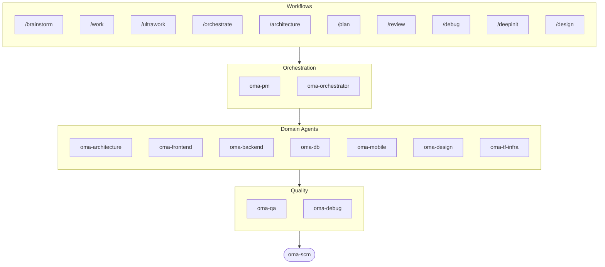

# oh-my-agent: Portable Multi-Agent Harness

[](https://www.npmjs.com/package/oh-my-agent) [](https://www.npmjs.com/package/oh-my-agent) [](https://github.com/first-fluke/oh-my-agent) [](https://github.com/first-fluke/oh-my-agent/blob/main/LICENSE) [](https://github.com/first-fluke/oh-my-agent/commits/main)

[English](../README.md) | [한국어](./README.ko.md) | [中文](./README.zh.md) | [Português](./README.pt.md) | [日本語](./README.ja.md) | [Français](./README.fr.md) | [Nederlands](./README.nl.md) | [Polski](./README.pl.md) | [Русский](./README.ru.md) | [Deutsch](./README.de.md) | [Tiếng Việt](./README.vi.md)

¿Alguna vez quisiste que tu asistente de IA tuviera compañeros de trabajo? Eso es lo que hace oh-my-agent.

En vez de que una sola IA haga todo (y se pierda a mitad de camino), oh-my-agent reparte el trabajo entre **agentes especializados** — frontend, backend, architecture, QA, PM, DB, mobile, infra, debug, design y más. Cada uno conoce su dominio a fondo, tiene sus propias herramientas y checklists, y se mantiene en su carril.

Funciona con todos los IDEs de IA principales: Antigravity, Claude Code, Cursor, Gemini CLI, Codex CLI, OpenCode y más.

## Inicio Rápido

```bash
# Una sola línea (instala bun y uv automáticamente si faltan)
curl -fsSL https://raw.githubusercontent.com/first-fluke/oh-my-agent/main/cli/install.sh | bash

# O manualmente
bunx oh-my-agent@latest
```

Elige un preset y listo:

| Preset | Lo Que Incluye |
|--------|-------------|
| ✨ All | Todos los agentes y skills |
| 🌐 Fullstack | architecture + frontend + backend + db + pm + qa + debug + brainstorm + commit |
| 🎨 Frontend | architecture + frontend + pm + qa + debug + brainstorm + commit |
| ⚙️ Backend | architecture + backend + db + pm + qa + debug + brainstorm + commit |
| 📱 Mobile | architecture + mobile + pm + qa + debug + brainstorm + commit |
| 🚀 DevOps | architecture + tf-infra + dev-workflow + pm + qa + debug + brainstorm + commit |

## Tu Equipo de Agentes

| Agente | Qué Hace |
|-------|-------------|
| **oma-architecture** | Trade-offs arquitectónicos, límites, análisis con mirada ADR/ATAM/CBAM |
| **oma-backend** | APIs en Python, Node.js o Rust |
| **oma-brainstorm** | Explora ideas antes de que te lances a construir |
| **oma-scm** | Commits convencionales limpios |
| **oma-db** | Diseño de esquemas, migraciones, indexación, vector DB |
| **oma-debug** | Análisis de causa raíz, correcciones, tests de regresión |
| **oma-design** | Sistemas de diseño, tokens, accesibilidad, responsive |
| **oma-dev-workflow** | CI/CD, releases, automatización de monorepo |
| **oma-frontend** | React/Next.js, TypeScript, Tailwind CSS v4, shadcn/ui |
| **oma-mobile** | Apps multiplataforma con Flutter |
| **oma-orchestrator** | Ejecución paralela de agentes vía CLI |
| **oma-pdf** | Conversión de PDF a Markdown |
| **oma-pm** | Planifica tareas, desglosa requisitos, define contratos de API |
| **oma-qa** | Seguridad OWASP, rendimiento, revisión de accesibilidad |
| **oma-tf-infra** | IaC multi-cloud con Terraform |
| **oma-translator** | Traducción multilingüe natural |

## Cómo Funciona

Solo chatea. Describe lo que quieres y oh-my-agent se encarga de elegir los agentes adecuados.

```
Tú: "Construye una app de TODO con autenticación de usuarios"
→ PM planifica el trabajo
→ Backend construye la API de auth
→ Frontend construye la UI en React
→ DB diseña el esquema
→ QA revisa todo
→ Listo: código coordinado y revisado
```

O usa slash commands para flujos estructurados:

| Comando | Qué Hace |
|---------|-------------|
| `/plan` | PM desglosa tu feature en tareas |
| `/work` | Ejecución multi-agente paso a paso |
| `/orchestrate` | Lanzamiento automatizado de agentes en paralelo |
| `/ultrawork` | Flujo de calidad en 5 fases con 11 puertas de revisión |
| `/review` | Auditoría de seguridad + rendimiento + accesibilidad |
| `/debug` | Debugging estructurado de causa raíz |
| `/design` | Flujo de sistema de diseño en 7 fases |
| `/brainstorm` | Ideación libre |
| `/scm` | Commit convencional con análisis de type/scope |

**Auto-detección**: Ni siquiera necesitas slash commands — palabras clave como "plan", "review", "debug" en tu mensaje (¡en 11 idiomas!) activan automáticamente el flujo correcto.

## CLI

```bash
# Instalar globalmente
bun install --global oh-my-agent   # o: brew install oh-my-agent

# Usar donde sea
oma doctor                  # Chequeo de salud
oma dashboard               # Monitoreo de agentes en tiempo real
oma agent:spawn backend "Build auth API" session-01
oma agent:parallel -i backend:"Auth API" frontend:"Login form"
```

## ¿Por Qué oh-my-agent?

> [Leer más →](https://github.com/first-fluke/oh-my-agent/issues/155#issuecomment-4142133589)

- **Portable** — `.agents/` viaja con tu proyecto, no queda atrapado en un IDE
- **Basado en roles** — Agentes modelados como un equipo de ingeniería real, no un montón de prompts
- **Eficiente en tokens** — Diseño de skills en dos capas ahorra ~75% de tokens
- **Calidad primero** — Charter preflight, quality gates y flujos de revisión integrados
- **Multi-vendor** — Mezcla Gemini, Claude, Codex y Qwen por tipo de agente
- **Observable** — Dashboards en terminal y web para monitoreo en tiempo real

## Arquitectura



## Más Información

- **[Documentación Detallada](./AGENTS_SPEC.md)** — Spec técnico completo y arquitectura
- **[Agentes Soportados](./SUPPORTED_AGENTS.md)** — Matriz de soporte de agentes por IDE
- **[Docs Web](https://first-fluke.github.io/oh-my-agent/)** — Guías, tutoriales y referencia del CLI

## Sponsors

Este proyecto se mantiene gracias a nuestros generosos sponsors.

> **¿Te gusta este proyecto?** ¡Dale una estrella!
>
> ```bash
> gh api --method PUT /user/starred/first-fluke/oh-my-agent
> ```
>
> Prueba nuestra plantilla starter optimizada: [fullstack-starter](https://github.com/first-fluke/fullstack-starter)

<a href="https://github.com/sponsors/first-fluke">
  
</a>
<a href="https://buymeacoffee.com/firstfluke">
  
</a>

### 🚀 Champion

<!-- Champion tier ($100/mo) logos here -->

### 🛸 Booster

<!-- Booster tier ($30/mo) logos here -->

### ☕ Contributor

<!-- Contributor tier ($10/mo) names here -->

[Hazte sponsor →](https://github.com/sponsors/first-fluke)

Consulta [SPONSORS.md](../SPONSORS.md) para la lista completa de supporters.


## Star History

[](https://www.star-history.com/#first-fluke/oh-my-agent&type=date&legend=bottom-right)


## Licencia

MIT
