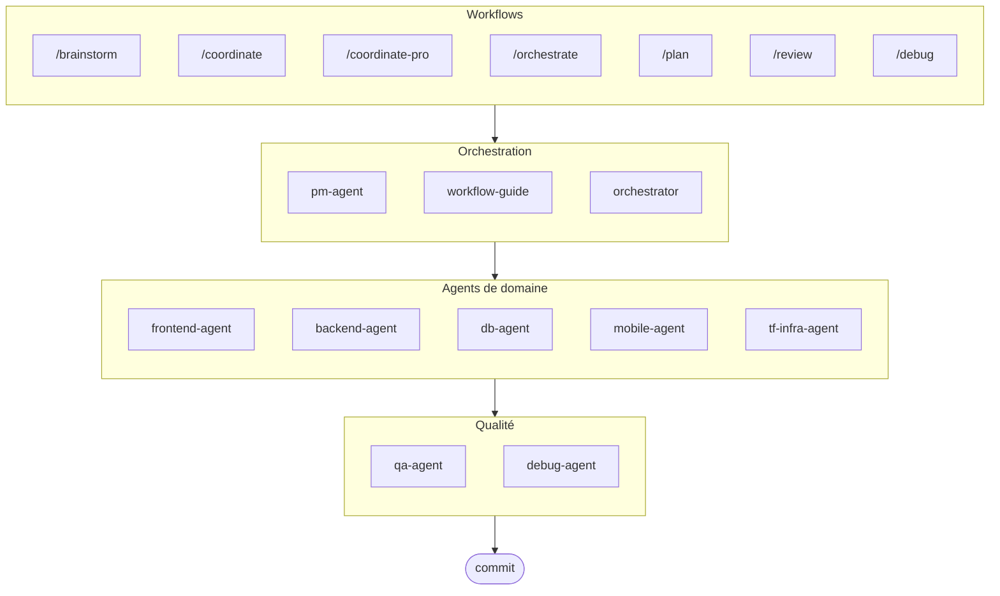

# oh-my-agent : Orchestrateur Multi-Agents

[](https://www.npmjs.com/package/oh-my-agent) [](https://www.npmjs.com/package/oh-my-agent) [](https://github.com/first-fluke/oh-my-agent) [](https://github.com/first-fluke/oh-my-agent/blob/main/LICENSE) [](https://github.com/first-fluke/oh-my-agent/commits/main)

[English](../README.md) | [한국어](./README.ko.md) | [中文](./README.zh.md) | [Português](./README.pt.md) | [日本語](./README.ja.md) | [Español](./README.es.md) | [Nederlands](./README.nl.md) | [Polski](./README.pl.md) | [Русский](./README.ru.md) | [Deutsch](./README.de.md)

L'Orchestrateur d'Agents Ultime pour le codage agentique.

Orchestrez 10 agents de domaine spécialisés (PM, Frontend, Backend, DB, Mobile, QA, Debug, Brainstorm, DevWorkflow, Terraform) via **Serena Memory**. Comprend l'exécution CLI parallèle, des tableaux de bord d'observabilité en temps réel et un chargement progressif de compétences sans configuration. La solution tout-en-un pour le codage agentique.

> **Ce projet vous plaît ?** Donnez-lui une étoile !
>
> ```bash
> gh api --method PUT /user/starred/first-fluke/oh-my-agent
> ```
>
> Essayez notre template de démarrage optimisé : [fullstack-starter](https://github.com/first-fluke/fullstack-starter)

## Table des matières

- [Architecture](#architecture)
- [Pourquoi différent](#pourquoi-différent)
- [Compatibilité](#compatibilité)
- [Spécification `.agents`](#spécification-agents)
- [Qu'est-ce que c'est ?](#quest-ce-que-cest-)
- [Démarrage rapide](#démarrage-rapide)
- [Sponsors](#sponsors)
- [Licence](#licence)

## Pourquoi différent

- **`.agents/` est la source de vérité** : les compétences, workflows, ressources partagées et configuration vivent dans une structure de projet portable au lieu d'être piégées dans un plugin IDE.
- **Équipes d'agents basées sur les rôles** : les agents PM, QA, DB, Infra, Frontend, Backend, Mobile, Debug et Workflow sont modélisés comme une organisation d'ingénierie, pas juste un tas de prompts.
- **Orchestration workflow-first** : la planification, la révision, le débogage et l'exécution coordonnée sont des workflows de première classe, pas des réflexions après coup.
- **Conception consciente des standards** : les agents portent désormais des conseils ciblés pour la planification ISO, le QA, la continuité/sécurité des bases de données et la gouvernance de l'infrastructure.
- **Conçu pour la vérification** : les tableaux de bord, la génération de manifestes, les protocoles d'exécution partagés et les sorties structurées favorisent la traçabilité plutôt que la génération basée sur le ressenti.

## Compatibilité

`oh-my-agent` est conçu autour de `.agents/` puis fait le pont vers d'autres dossiers de compétences spécifiques aux outils si nécessaire.

| Outil / IDE | Source des compétences | Mode d'interopérabilité | Notes |
|------------|---------------|--------------|-------|
| Antigravity | `.agents/skills/` | Natif | Principale disposition source-de-vérité |
| Claude Code | `.claude/skills/` | Lien symbolique vers `.agents/skills/` | Géré par l'installateur |
| OpenCode | `.agents/skills/` | Natif-compatible | Utilise la même source de compétences au niveau du projet |
| Amp | `.agents/skills/` | Natif-compatible | Partage la même source au niveau du projet |
| Codex CLI | `.agents/skills/` | Natif-compatible | Fonctionne à partir de la même source de compétences |
| Cursor | `.agents/skills/` | Natif-compatible | Peut consommer la même source de compétences |
| GitHub Copilot | `.github/skills/` | Lien symbolique optionnel | Installé lors de la sélection pendant la configuration |

Voir [SUPPORTED_AGENTS.md](./SUPPORTED_AGENTS.md) pour la matrice de support actuelle et les notes d'interopérabilité.

## Spécification `.agents`

`oh-my-agent` traite `.agents/` comme une convention de projet portable pour les compétences, workflows et contexte partagé des agents.

- Les compétences vivent dans `.agents/skills/<skill-name>/SKILL.md`
- Les ressources partagées vivent dans `.agents/skills/_shared/`
- Les workflows vivent dans `.agents/workflows/*.md`
- La configuration du projet vit dans `.agents/config/`
- Les métadonnées CLI et l'emballage restent alignés via des manifestes générés

Voir [AGENTS_SPEC.md](./AGENTS_SPEC.md) pour la disposition du projet, les fichiers requis, les règles d'interopérabilité et le modèle source-de-vérité.

## Architecture



## Qu'est-ce que c'est ?

Une collection de **Compétences Agent** permettant le développement collaboratif multi-agents. Le travail est distribué entre agents experts :

| Agent | Spécialisation | Déclencheurs |
|-------|---------------|--------------|
| **Brainstorm** | Idéation design-first avant la planification | "brainstorm", "ideate", "explore idea" |
| **Workflow Guide** | Coordonne les projets multi-agents complexes | "multi-domaine", "projet complexe" |
| **PM Agent** | Analyse des exigences, décomposition des tâches, architecture | "planifier", "décomposer", "que devons-nous construire" |
| **Frontend Agent** | React/Next.js, TypeScript, Tailwind CSS | "UI", "composant", "style" |
| **Backend Agent** | FastAPI, PostgreSQL, authentification JWT | "API", "base de données", "authentification" |
| **DB Agent** | Modélisation SQL/NoSQL, normalisation, intégrité, sauvegarde, capacité | "ERD", "schéma", "database design", "index tuning" |
| **Mobile Agent** | Développement multiplateforme Flutter | "application mobile", "iOS/Android" |
| **QA Agent** | Sécurité OWASP Top 10, performance, accessibilité | "vérifier sécurité", "audit", "vérifier performance" |
| **Debug Agent** | Diagnostic de bugs, analyse de cause racine, tests de régression | "bug", "erreur", "crash" |
| **Developer Workflow** | Automatisation des tâches monorepo, tâches mise, CI/CD, migrations, release | "workflow dev", "tâches mise", "pipeline CI/CD" |
| **TF Infra Agent** | Provisionnement IaC multi-cloud (AWS, GCP, Azure, OCI) | "infrastructure", "terraform", "config cloud" |
| **Orchestrator** | Exécution parallèle d'agents via CLI avec Serena Memory | "lancer agent", "exécution parallèle" |
| **Commit** | Commits conventionnels avec règles spécifiques au projet | "commit", "enregistrer changements" |

## Démarrage rapide

### Prérequis

- **AI IDE** (Antigravity, Claude Code, Codex, Gemini, etc.)
- **Bun** (pour CLI et tableaux de bord)
- **uv** (pour configuration Serena)

### Option 1 : CLI interactive (Recommandé)

```bash
# Installez bun si vous ne l'avez pas :
# curl -fsSL https://bun.sh/install | bash

# Installez uv si vous ne l'avez pas :
# curl -LsSf https://astral.sh/uv/install.sh | sh

bunx oh-my-agent
```

Sélectionnez votre type de projet et les compétences seront installées dans `.agents/skills/`.

| Préréglage | Compétences |
|------------|-------------|
| ✨ All | Tout |
| 🌐 Fullstack | brainstorm, frontend, backend, db, pm, qa, debug, commit |
| 🎨 Frontend | brainstorm, frontend, pm, qa, debug, commit |
| ⚙️ Backend | brainstorm, backend, db, pm, qa, debug, commit |
| 📱 Mobile | brainstorm, mobile, pm, qa, debug, commit |
| 🚀 DevOps | brainstorm, tf-infra, dev-workflow, pm, qa, debug, commit |

### Option 2 : Installation globale (Pour Orchestrator)

Pour utiliser les outils principaux globalement ou exécuter le SubAgent Orchestrator :

```bash
bun install --global oh-my-agent
```

Vous aurez également besoin d'au moins un outil CLI :

| CLI | Installation | Authentification |
|-----|--------------|------------------|
| Gemini | `bun install --global @anthropic-ai/gemini-cli` | `gemini auth` |
| Claude | `curl -fsSL https://claude.ai/install.sh \| bash` | `claude auth` |
| Codex | `bun install --global @openai/codex` | `codex auth` |
| Qwen | `bun install --global @qwen-code/qwen` | `qwen auth` |

### Option 3 : Intégrer dans un projet existant

**Recommandé (CLI) :**

Exécutez la commande suivante à la racine de votre projet pour installer/mettre à jour automatiquement les compétences et workflows :

```bash
bunx oh-my-agent
```

> **Astuce :** Exécutez `bunx oh-my-agent doctor` après l'installation pour vérifier que tout est correctement configuré (y compris les workflows globaux).

### 2. Discussion

**Tâche simple** (agent unique s'active automatiquement) :

```
"Créer un formulaire de connexion avec Tailwind CSS et validation de formulaire"
→ frontend-agent s'active
```

**Projet complexe** (workflow-guide coordonne) :

```
"Construire une application TODO avec authentification utilisateur"
→ workflow-guide → PM Agent planifie → agents générés dans Agent Manager
```

**Coordination explicite** (workflow déclenché par l'utilisateur) :

```
/coordinate
→ Étape par étape : planification PM → génération d'agents → revue QA
```

**Enregistrer les changements** (commits conventionnels) :

```
/commit
→ Analyser changements, suggérer type/portée de commit, créer commit avec Co-Author
```

### 3. Surveiller avec les tableaux de bord

Pour la configuration et les détails d'utilisation des tableaux de bord, voir [`web/content/fr/guide/usage.md`](./web/content/fr/guide/usage.md#tableaux-de-bord-en-temps-réel).

## Sponsors

Ce projet est maintenu grâce à nos généreux sponsors.

<a href="https://github.com/sponsors/first-fluke">
  
</a>
<a href="https://buymeacoffee.com/firstfluke">
  
</a>

### 🚀 Champion

<!-- Logos niveau Champion ($100/mois) ici -->

### 🛸 Booster

<!-- Logos niveau Booster ($30/mois) ici -->

### ☕ Contributor

<!-- Noms niveau Contributor ($10/mois) ici -->

[Devenir sponsor →](https://github.com/sponsors/first-fluke)

Voir [SPONSORS.md](./SPONSORS.md) pour la liste complète des supporters.

## Historique des étoiles

[](https://www.star-history.com/#first-fluke/oh-my-agent&type=date&legend=bottom-right)

## Licence

MIT
