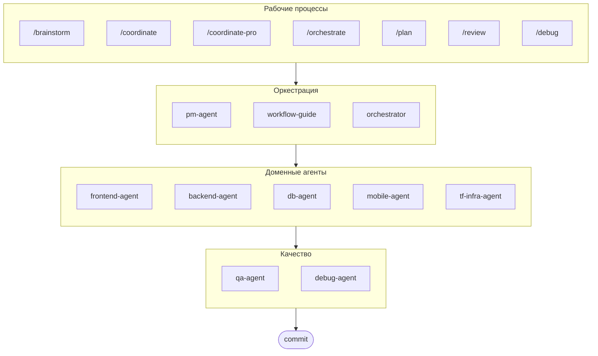

# oh-my-agent: Мультиагентный оркестратор

[](https://www.npmjs.com/package/oh-my-agent) [](https://www.npmjs.com/package/oh-my-agent) [](https://github.com/first-fluke/oh-my-agent) [](https://github.com/first-fluke/oh-my-agent/blob/main/LICENSE) [](https://github.com/first-fluke/oh-my-agent/commits/main)

[English](../README.md) | [한국어](./README.ko.md) | [中文](./README.zh.md) | [Português](./README.pt.md) | [日本語](./README.ja.md) | [Français](./README.fr.md) | [Español](./README.es.md) | [Nederlands](./README.nl.md) | [Polski](./README.pl.md) | [Deutsch](./README.de.md)

Идеальный мультиагентный оркестратор для агентного программирования.

Управляйте 10 специализированными доменными агентами (PM, Frontend, Backend, DB, Mobile, QA, Debug, Brainstorm, DevWorkflow, Terraform) через **Serena Memory**. Параллельное выполнение через CLI, информационные панели реального времени и постепенная загрузка навыков без настройки. Готовое решение для агентного программирования.

> **Понравился проект?** Поставьте звезду!
>
> ```bash
> gh api --method PUT /user/starred/first-fluke/oh-my-agent
> ```
>
> Попробуйте наш оптимизированный стартовый шаблон: [fullstack-starter](https://github.com/first-fluke/fullstack-starter)

## Оглавление

- [Архитектура](#архитектура)
- [Почему другой](#почему-другой)
- [Совместимость](#совместимость)
- [Спецификация `.agents`](#спецификация-agents)
- [Что это такое?](#что-это-такое)
- [Быстрый старт](#быстрый-старт)
- [Спонсоры](#спонсоры)
- [Лицензия](#лицензия)

## Почему другой

- **`.agents/` является источником истины**: skills, workflows, общие ресурсы и конфигурация живут в одной переносимой структуре проекта вместо того, чтобы быть запертыми внутри одного IDE плагина.
- **Команды агентов на основе ролей**: агенты PM, QA, DB, Infra, Frontend, Backend, Mobile, Debug и Workflow моделируются как инженерная организация, а не просто куча промптов.
- **Workflow-first оркестрация**: планирование, обзор, отладка и координированное выполнение являются workflows первого класса, а не запоздалыми мыслями.
- **Стандарт-осознанный дизайн**: агенты теперь несут сфокусированное руководство для ISO-управляемого планирования, QA, непрерывности/безопасности баз данных и управления инфраструктурой.
- **Построен для верификации**: дашборды, генерация манифестов, общие протоколы выполнения и структурированные выходы отдают предпочтение отслеживаемости над генерацией только на основе ощущений.

## Совместимость

`oh-my-agent` спроектирован вокруг `.agents/` и затем мостит к другим инструмент-специфичным папкам skills, когда это необходимо.

| Инструмент / IDE | Источник Skills | Режим совместимости | Примечания |
|------------|---------------|--------------|-------|
| Antigravity | `.agents/skills/` | Нативный | Основная макет источника-истины |
| Claude Code | `.claude/skills/` | Символьная ссылка на `.agents/skills/` | Управляется установщиком |
| OpenCode | `.agents/skills/` | Нативно-совместимый | Использует тот же источник skills на уровне проекта |
| Amp | `.agents/skills/` | Нативно-совместимый | Разделяет тот же источник на уровне проекта |
| Codex CLI | `.agents/skills/` | Нативно-совместимый | Работает из того же источника skills проекта |
| Cursor | `.agents/skills/` | Нативно-совместимый | Может потреблять тот же источник skills на уровне проекта |
| GitHub Copilot | `.github/skills/` | Опциональная символьная ссылка | Устанавливается при выборе во время настройки |

Смотрите [SUPPORTED_AGENTS.md](./SUPPORTED_AGENTS.md) для текущей матрицы поддержки и примечаний о совместимости.

## Спецификация `.agents`

`oh-my-agent` рассматривает `.agents/` как переносимое соглашение проекта для skills, workflows и общего контекста агентов.

- Skills живут в `.agents/skills/<skill-name>/SKILL.md`
- Общие ресурсы живут в `.agents/skills/_shared/`
- Workflows живут в `.agents/workflows/*.md`
- Конфигурация проекта живет в `.agents/config/`
- Метаданные CLI и упаковка остаются выровненными через сгенерированные манифесты

Смотрите [AGENTS_SPEC.md](./AGENTS_SPEC.md) для макета проекта, требуемых файлов, правил совместимости и модели источника-истины.

## Архитектура



## Что это такое?

Коллекция **Agent Skills**, обеспечивающих совместную мультиагентную разработку. Работа распределяется между экспертными агентами:

| Агент | Специализация | Триггеры |
|-------|---------------|----------|
| **Brainstorm** | Идеация с приоритетом дизайна перед планированием | "brainstorm", "ideate", "explore idea" |
| **Workflow Guide** | Координирует сложные мультиагентные проекты | "мультидомен", "сложный проект" |
| **PM Agent** | Анализ требований, декомпозиция задач, архитектура | "план", "разбить", "что нужно построить" |
| **Frontend Agent** | React/Next.js, TypeScript, Tailwind CSS | "UI", "компонент", "стилизация" |
| **Backend Agent** | FastAPI, PostgreSQL, JWT аутентификация | "API", "база данных", "аутентификация" |
| **DB Agent** | SQL/NoSQL моделирование, нормализация, целостность, резервное копирование, оценка емкости | "ERD", "схема", "проектирование БД", "настройка индексов" |
| **Mobile Agent** | Flutter кроссплатформенная разработка | "мобильное приложение", "iOS/Android" |
| **QA Agent** | Безопасность OWASP Top 10, производительность, доступность | "проверка безопасности", "аудит", "проверка производительности" |
| **Debug Agent** | Диагностика багов, анализ первопричин, регрессионные тесты | "баг", "ошибка", "краш" |
| **Developer Workflow** | Автоматизация задач монорепо, задачи mise, CI/CD, миграции, релиз | "dev workflow", "задачи mise", "CI/CD пайплайн" |
| **TF Infra Agent** | Мультиоблачное IaC провизионирование (AWS, GCP, Azure, OCI) | "инфраструктура", "terraform", "настройка облака" |
| **Orchestrator** | CLI-основанное параллельное выполнение агентов с Serena Memory | "запустить агента", "параллельное выполнение" |
| **Commit** | Conventional Commits с проектными правилами | "коммит", "сохранить изменения" |

## Быстрый старт

### Предварительные требования

- **AI IDE** (Antigravity, Claude Code, Codex, Gemini, etc.)
- **Bun** (для CLI и информационных панелей)
- **uv** (для настройки Serena)

### Вариант 1: Интерактивный CLI (Рекомендуется)

```bash
# Установите bun, если у вас его нет:
# curl -fsSL https://bun.sh/install | bash

# Установите uv, если у вас его нет:
# curl -LsSf https://astral.sh/uv/install.sh | sh

bunx oh-my-agent
```

Выберите тип проекта, и навыки будут установлены в `.agents/skills/`.

| Пресет | Навыки |
|--------|--------|
| ✨ All | Все |
| 🌐 Fullstack | brainstorm, frontend, backend, db, pm, qa, debug, commit |
| 🎨 Frontend | brainstorm, frontend, pm, qa, debug, commit |
| ⚙️ Backend | brainstorm, backend, db, pm, qa, debug, commit |
| 📱 Mobile | brainstorm, mobile, pm, qa, debug, commit |
| 🚀 DevOps | brainstorm, tf-infra, dev-workflow, pm, qa, debug, commit |

### Вариант 2: Глобальная установка (Для оркестратора)

Чтобы использовать основные инструменты глобально или запустить SubAgent Orchestrator:

```bash
bun install --global oh-my-agent
```

Вам также потребуется хотя бы один CLI инструмент:

| CLI | Установка | Авторизация |
|-----|-----------|-------------|
| Gemini | `bun install --global @anthropic-ai/gemini-cli` | `gemini auth` |
| Claude | `curl -fsSL https://claude.ai/install.sh \| bash` | `claude auth` |
| Codex | `bun install --global @openai/codex` | `codex auth` |
| Qwen | `bun install --global @qwen-code/qwen` | `qwen auth` |

### Вариант 3: Интеграция в существующий проект

**Рекомендуется (CLI):**

Выполните следующую команду в корне вашего проекта для автоматической установки/обновления навыков и рабочих процессов:

```bash
bunx oh-my-agent
```

> **Совет:** Запустите `bunx oh-my-agent doctor` после установки, чтобы проверить правильность настройки (включая глобальные рабочие процессы).

### 3. Использование

**Простая задача** (один агент активируется автоматически):

```
"Создай форму входа с Tailwind CSS и валидацией формы"
→ активируется frontend-agent
```

**Сложный проект** (workflow-guide координирует):

```
"Построй TODO приложение с аутентификацией пользователей"
→ workflow-guide → PM Agent планирует → агенты запускаются в Agent Manager
```

**Явная координация** (рабочий процесс, запущенный пользователем):

```
/coordinate
→ Шаг за шагом: планирование PM → запуск агентов → проверка QA
```

**Фиксация изменений** (conventional commits):

```
/commit
→ Анализ изменений, предложение типа/области коммита, создание коммита с Co-Author
```

### 3. Мониторинг с помощью информационных панелей

Для настройки и использования информационных панелей см. [`docs/USAGE.md`](./docs/USAGE.md#real-time-dashboards).

## Спонсоры

Этот проект поддерживается благодаря нашим щедрым спонсорам.

<a href="https://github.com/sponsors/first-fluke">
  
</a>
<a href="https://buymeacoffee.com/firstfluke">
  
</a>

### 🚀 Champion

<!-- Логотипы уровня Champion ($100/месяц) здесь -->

### 🛸 Booster

<!-- Логотипы уровня Booster ($30/месяц) здесь -->

### ☕ Contributor

<!-- Имена уровня Contributor ($10/месяц) здесь -->

[Стать спонсором →](https://github.com/sponsors/first-fluke)

См. [SPONSORS.md](./SPONSORS.md) для полного списка поддержавших.

## История звезд

[](https://www.star-history.com/#first-fluke/oh-my-agent&type=date&legend=bottom-right)

## Лицензия

MIT
