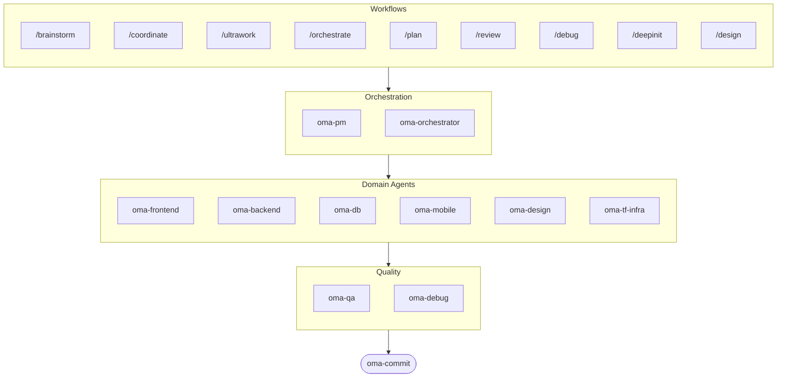

# oh-my-agent: Portable Multi-Agent Harness

[](https://www.npmjs.com/package/oh-my-agent) [](https://www.npmjs.com/package/oh-my-agent) [](https://github.com/first-fluke/oh-my-agent) [](https://github.com/first-fluke/oh-my-agent/blob/main/LICENSE) [](https://github.com/first-fluke/oh-my-agent/commits/main)

[English](../README.md) | [한국어](./README.ko.md) | [中文](./README.zh.md) | [Português](./README.pt.md) | [日本語](./README.ja.md) | [Français](./README.fr.md) | [Español](./README.es.md) | [Nederlands](./README.nl.md) | [Polski](./README.pl.md) | [Русский](./README.ru.md) | [Deutsch](./README.de.md) | [Tiếng Việt](./README.vi.md)

เคยคิดไหมว่าถ้า AI assistant ของคุณมีเพื่อนร่วมงานก็คงดี? นั่นแหละคือสิ่งที่ oh-my-agent ทำ

แทนที่จะให้ AI ตัวเดียวทำทุกอย่างจนหลงทางกลางคัน oh-my-agent จะแบ่งงานให้กับ **เอเจนต์เฉพาะทาง** ไม่ว่าจะเป็น frontend, backend, QA, PM, DB, mobile, infra, debug, design และอีกมากมาย แต่ละตัวเชี่ยวชาญในโดเมนของตัวเอง มีเครื่องมือและเช็กลิสต์เฉพาะทาง และโฟกัสกับงานในบทบาทของตัวเอง

ใช้งานได้กับ AI IDE ชั้นนำทั้งหมด: Antigravity, Claude Code, Cursor, Gemini CLI, Codex CLI, OpenCode และอื่น ๆ

## เริ่มต้นอย่างรวดเร็ว

```bash
# คำสั่งบรรทัดเดียว (ติดตั้ง bun และ uv อัตโนมัติหากยังไม่มี)
curl -fsSL https://raw.githubusercontent.com/first-fluke/oh-my-agent/main/cli/install.sh | bash

# หรือรันแบบแมนนวล
bunx oh-my-agent@latest
```

`install.sh` รองรับเฉพาะ macOS/Linux เท่านั้น บน Windows ให้ติดตั้ง `bun` และ `uv` เองก่อน แล้วค่อยรัน `bunx oh-my-agent@latest`

เลือก preset หนึ่งอันแล้วเริ่มได้ทันที:

| Preset | สิ่งที่จะได้ |
|--------|-------------|
| ✨ All | เอเจนต์และสกิลทั้งหมด |
| 🌐 Fullstack | frontend + backend + db + pm + qa + debug + brainstorm + commit |
| 🎨 Frontend | frontend + pm + qa + debug + brainstorm + commit |
| ⚙️ Backend | backend + db + pm + qa + debug + brainstorm + commit |
| 📱 Mobile | mobile + pm + qa + debug + brainstorm + commit |
| 🚀 DevOps | tf-infra + dev-workflow + pm + qa + debug + brainstorm + commit |

## ทีมเอเจนต์ของคุณ

| Agent | ทำอะไร |
|-------|--------|
| **oma-brainstorm** | สำรวจไอเดียก่อนเริ่มลงมือสร้าง |
| **oma-pm** | วางแผนงาน แยก requirement และกำหนด API contract |
| **oma-frontend** | React/Next.js, TypeScript, Tailwind CSS v4, shadcn/ui |
| **oma-backend** | พัฒนา API ด้วย Python, Node.js หรือ Rust |
| **oma-db** | ออกแบบ schema, migration, indexing และ vector DB |
| **oma-mobile** | แอป Flutter แบบข้ามแพลตฟอร์ม |
| **oma-design** | design system, token, accessibility และ responsive |
| **oma-qa** | ตรวจสอบความปลอดภัยแบบ OWASP, ประสิทธิภาพ และ accessibility |
| **oma-debug** | วิเคราะห์ root cause, แก้ปัญหา และเขียน regression test |
| **oma-tf-infra** | Terraform IaC แบบ multi-cloud |
| **oma-dev-workflow** | CI/CD, release และ automation สำหรับ monorepo |
| **oma-translator** | แปลหลายภาษาให้เป็นธรรมชาติ |
| **oma-orchestrator** | รันเอเจนต์แบบขนานผ่าน CLI |
| **oma-commit** | conventional commit ที่สะอาดและเป็นระเบียบ |

## วิธีการทำงาน

แค่คุยกับมัน บอกสิ่งที่คุณต้องการ แล้ว oh-my-agent จะเลือกเอเจนต์ที่เหมาะสมให้เอง

```
You: "Build a TODO app with user authentication"
→ PM วางแผนงาน
→ Backend สร้าง auth API
→ Frontend สร้าง React UI
→ DB ออกแบบ schema
→ QA ตรวจทานทั้งหมด
→ เสร็จ: โค้ดถูกประสานงานและรีวิวแล้ว
```

หรือจะใช้ slash command สำหรับ workflow ที่มีโครงสร้างชัดเจนก็ได้:

| Command | ทำอะไร |
|---------|--------|
| `/plan` | ให้ PM แยกฟีเจอร์ออกเป็นงานย่อย |
| `/coordinate` | รันงานหลายเอเจนต์แบบทีละขั้น |
| `/orchestrate` | spawn เอเจนต์แบบขนานโดยอัตโนมัติ |
| `/ultrawork` | workflow คุณภาพ 5 เฟส พร้อม 11 review gate |
| `/review` | audit ด้าน security + performance + accessibility |
| `/debug` | debug หา root cause แบบมีโครงสร้าง |
| `/design` | workflow design system 7 เฟส |
| `/brainstorm` | ระดมไอเดียแบบอิสระ |
| `/commit` | conventional commit พร้อมวิเคราะห์ type/scope |

**ตรวจจับอัตโนมัติ**: ต่อให้ไม่ใช้ slash command ถ้าข้อความของคุณมีคำอย่าง "plan", "review", "debug" (รองรับ 11 ภาษา!) ระบบก็จะเปิด workflow ที่เหมาะสมให้อัตโนมัติ

## CLI

```bash
# ติดตั้งแบบ global
bun install --global oh-my-agent   # หรือ: brew install oh-my-agent

# ใช้ได้จากทุกที่
oma doctor                  # ตรวจสุขภาพระบบ
oma dashboard               # มอนิเตอร์เอเจนต์แบบเรียลไทม์
oma agent:spawn backend "Build auth API" session-01
oma agent:parallel -i backend:"Auth API" frontend:"Login form"
```

## ทำไมต้อง oh-my-agent?

> [อ่านเหตุผลเพิ่มเติม →](https://github.com/first-fluke/oh-my-agent/issues/155#issuecomment-4142133589)

- **พกพาได้** — โฟลเดอร์ `.agents/` เดินทางไปพร้อมโปรเจกต์ ไม่ถูกล็อกไว้กับ IDE ตัวเดียว
- **อิงตามบทบาท** — ออกแบบเอเจนต์ให้เหมือนทีมวิศวกรรมจริง ไม่ใช่กอง prompt ที่โยนรวมกัน
- **ประหยัดโทเคน** — การออกแบบสกิลสองชั้นช่วยลดการใช้โทเคนได้ราว 75%
- **คุณภาพมาก่อน** — มี charter preflight, quality gate และ workflow รีวิวมาให้ในตัว
- **หลายผู้ให้บริการ** — ผสมการใช้ Gemini, Claude, Codex และ Qwen ตามประเภทเอเจนต์ได้
- **สังเกตการณ์ได้** — มีทั้งแดชบอร์ดบนเทอร์มินัลและเว็บสำหรับติดตามแบบเรียลไทม์

## สถาปัตยกรรม



## เรียนรู้เพิ่มเติม

- **[เอกสารแบบละเอียด](./AGENTS_SPEC.md)** — สเปกทางเทคนิคและสถาปัตยกรรมฉบับเต็ม
- **[เอเจนต์ที่รองรับ](./SUPPORTED_AGENTS.md)** — ตารางรองรับเอเจนต์ในแต่ละ IDE
- **[เว็บเอกสาร](https://first-fluke.github.io/oh-my-agent/)** — คู่มือ บทช่วยสอน และ CLI reference

## ผู้สนับสนุน

โปรเจกต์นี้ดำเนินต่อได้ด้วยการสนับสนุนจากสปอนเซอร์ของเรา

> **ชอบโปรเจกต์นี้ไหม?** กดดาวให้หน่อย!
>
> ```bash
> gh api --method PUT /user/starred/first-fluke/oh-my-agent
> ```
>
> ลองใช้ starter template ที่เราปรับมาอย่างดีได้ที่: [fullstack-starter](https://github.com/first-fluke/fullstack-starter)

<a href="https://github.com/sponsors/first-fluke">
  
</a>
<a href="https://buymeacoffee.com/firstfluke">
  
</a>

### 🚀 Champion

<!-- Champion tier ($100/mo) logos here -->

### 🛸 Booster

<!-- Booster tier ($30/mo) logos here -->

### ☕ Contributor

<!-- Contributor tier ($10/mo) names here -->

[ร่วมเป็นสปอนเซอร์ →](https://github.com/sponsors/first-fluke)

ดูรายชื่อผู้สนับสนุนทั้งหมดได้ที่ [SPONSORS.md](../SPONSORS.md)


## Star History

[](https://www.star-history.com/#first-fluke/oh-my-agent&type=date&legend=bottom-right)


## ใบอนุญาต

MIT
