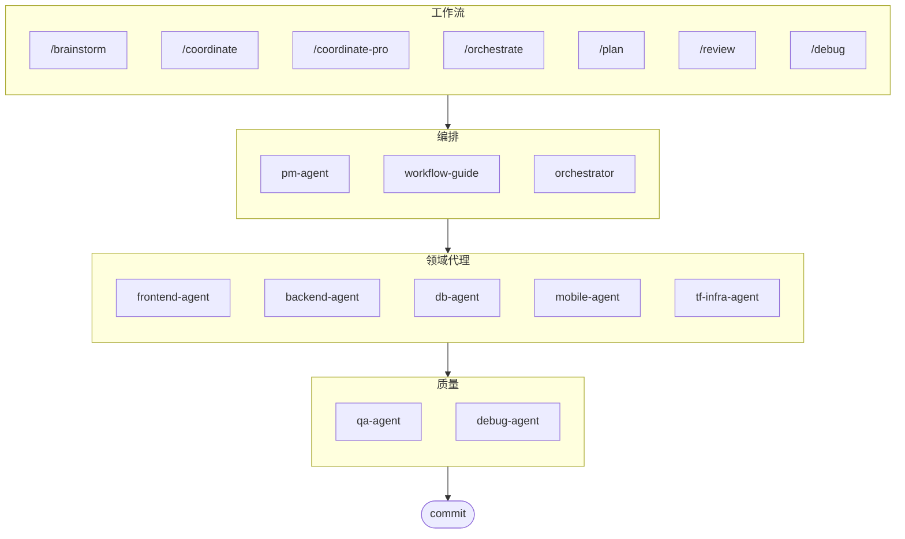

# oh-my-agent: 多代理编排器

[](https://www.npmjs.com/package/oh-my-agent) [](https://www.npmjs.com/package/oh-my-agent) [](https://github.com/first-fluke/oh-my-agent) [](https://github.com/first-fluke/oh-my-agent/blob/main/LICENSE) [](https://github.com/first-fluke/oh-my-agent/commits/main)

[English](../README.md) | [한국어](./README.ko.md) | [Português](./README.pt.md) | [日本語](./README.ja.md) | [Français](./README.fr.md) | [Español](./README.es.md) | [Nederlands](./README.nl.md) | [Polski](./README.pl.md) | [Русский](./README.ru.md) | [Deutsch](./README.de.md)

终极代理编排器，适用于智能编程及更多场景。

通过 **Serena Memory** 编排 10 个专业领域代理（PM、Frontend、Backend、DB、Mobile、QA、Debug、Brainstorm、DevWorkflow、Terraform）。支持并行 CLI 执行、实时可观测性仪表盘，以及零配置渐进式技能加载。开箱即用的代理编程解决方案。

## 目录

- [架构](#架构)
- [为何不同](#为何不同)
- [兼容性](#兼容性)
- [`.agents` 规范](#agents-规范)
- [这是什么？](#这是什么)
- [快速开始](#快速开始)
- [赞助商](#赞助商)
- [许可证](#许可证)

## 为何不同

- **`.agents/` 是真实来源**：技能、工作流、共享资源和配置生活在一个可移植的项目结构中，而不是被困在某个 IDE 插件内。
- **角色化代理团队**：PM、QA、DB、Infra、Frontend、Backend、Mobile、Debug 和 Workflow 代理被建模为工程组织，而不仅仅是一堆提示词。
- **工作流优先编排**：规划、审查、调试和协调执行是一等公民的工作流，而不是事后想法。
- **标准感知设计**：代理现在携带针对 ISO 驱动的规划、QA、数据库连续性/安全和基础设施治理的集中指导。
- **为验证而生**：仪表盘、清单生成、共享执行协议和结构化输出 favor 可追溯性而非仅靠感觉生成。

## 兼容性

`oh-my-agent` 围绕 `.agents/` 设计，然后在需要时桥接到其他工具特定的技能文件夹。

| 工具 / IDE | 技能来源 | 互操作模式 | 备注 |
|------------|---------------|--------------|-------|
| Antigravity | `.agents/skills/` | 原生 | 主要真实来源布局 |
| Claude Code | `.claude/skills/` | 符号链接到 `.agents/skills/` | 由安装器管理 |
| OpenCode | `.agents/skills/` | 原生兼容 | 使用相同的项目级技能来源 |
| Amp | `.agents/skills/` | 原生兼容 | 共享相同的项目级来源 |
| Codex CLI | `.agents/skills/` | 原生兼容 | 从相同的项目技能来源工作 |
| Cursor | `.agents/skills/` | 原生兼容 | 可以消费相同的项目级技能来源 |
| GitHub Copilot | `.github/skills/` | 可选符号链接 | 安装时选择时安装 |

当前支持矩阵和互操作性说明请参阅 [SUPPORTED_AGENTS.md](./SUPPORTED_AGENTS.md)。

## `.agents` 规范

`oh-my-agent` 将 `.agents/` 视为用于代理技能、工作流和共享上下文的可移植项目约定。

- 技能位于 `.agents/skills/<skill-name>/SKILL.md`
- 共享资源位于 `.agents/skills/_shared/`
- 工作流位于 `.agents/workflows/*.md`
- 项目配置位于 `.agents/config/`
- CLI 元数据和打包通过生成的清单保持一致

有关项目布局、必需文件、互操作性规则和真实来源模型的详细信息，请参阅 [AGENTS_SPEC.md](./AGENTS_SPEC.md)。

## 架构



## 这是什么？

一套 **Agent 技能**集合，支持协作式多代理开发。工作被分配给各专业代理：

| 代理 | 专业领域 | 触发条件 |
|------|---------|---------|
| **Brainstorm** | 规划前的设计优先构思 | "brainstorm", "ideate", "explore idea" |
| **Workflow Guide** | 协调复杂的多代理项目 | "multi-domain", "complex project" |
| **PM Agent** | 需求分析、任务分解、架构设计 | "plan", "break down", "what should we build" |
| **Frontend Agent** | React/Next.js、TypeScript、Tailwind CSS | "UI", "component", "styling" |
| **Backend Agent** | FastAPI、PostgreSQL、JWT 认证 | "API", "database", "authentication" |
| **DB Agent** | SQL/NoSQL 建模、规范化、完整性、备份、容量规划 | "ERD", "schema", "database design", "index tuning" |
| **Mobile Agent** | Flutter 跨平台开发 | "mobile app", "iOS/Android" |
| **QA Agent** | OWASP Top 10 安全、性能、可访问性 | "review security", "audit", "check performance" |
| **Debug Agent** | Bug 诊断、根因分析、回归测试 | "bug", "error", "crash" |
| **Developer Workflow** | 单仓库任务自动化、mise 任务、CI/CD、迁移、发布 | "开发工作流"、"mise 任务"、"CI/CD 管道" |
| **TF Infra Agent** | 多云 IaC 基础设施配置（AWS、GCP、Azure、OCI） | "基础设施"、"terraform"、"云部署" |
| **Orchestrator** | 基于 CLI 的并行代理执行，使用 Serena Memory | "spawn agent", "parallel execution" |
| **Commit** | 遵循项目特定规则的 Conventional Commits | "commit", "save changes" |

## 快速开始

### 前置条件

- **AI IDE**（Antigravity, Claude Code, Codex, Gemini, etc.）
- **Bun**（用于 CLI 和仪表盘）
- **uv**（用于 Serena 配置）

### 选项 1：交互式 CLI（推荐）

```bash
# Install bun if you don't have it:
# curl -fsSL https://bun.sh/install | bash

# Install uv if you don't have it:
# curl -LsSf https://astral.sh/uv/install.sh | sh

bunx oh-my-agent
```

选择你的项目类型，技能将安装到 `.agents/skills/`。

| 预设 | 技能 |
|------|------|
| ✨ 全部 | 所有技能 |
| 🌐 全栈 | brainstorm, frontend, backend, db, pm, qa, debug, commit |
| 🎨 前端 | brainstorm, frontend, pm, qa, debug, commit |
| ⚙️ 后端 | brainstorm, backend, db, pm, qa, debug, commit |
| 📱 移动端 | brainstorm, mobile, pm, qa, debug, commit |
| 🚀 DevOps | brainstorm, tf-infra, dev-workflow, pm, qa, debug, commit |

### 选项 2：全局安装（用于编排器）

若要全局使用核心工具或运行 SubAgent Orchestrator：

```bash
bun install --global oh-my-agent
```

你还需要至少安装一个 CLI 工具：

| CLI | 安装 | 认证 |
|-----|------|------|
| Gemini | `bun install --global @google/gemini-cli` | `gemini auth` |
| Claude | `curl -fsSL https://claude.ai/install.sh \| bash` | `claude auth` |
| Codex | `bun install --global @openai/codex` | `codex auth` |
| Qwen | `bun install --global @qwen-code/qwen` | `qwen auth` |

### 选项 3：集成到现有项目

**推荐（CLI）：**

在项目根目录运行以下命令，自动安装/更新技能和工作流：

```bash
bunx oh-my-agent
```

> **提示：** 安装后运行 `bunx oh-my-agent doctor` 可验证所有配置是否正确（包括全局工作流）。


### 2. 对话

**显式协调**（用户触发的工作流）：

```
/coordinate
→ Step-by-step: PM planning → agent spawning → QA review
```

**复杂项目**（workflow-guide 协调）：

```
"Build a TODO app with user authentication"
→ workflow-guide → PM Agent plans → agents spawned in Agent Manager
```

**简单任务**（单个代理自动激活）：

```
"Create a login form with Tailwind CSS and form validation"
→ frontend-agent activates
```

**提交变更**（conventional commits）：

```
/commit
→ Analyze changes, suggest commit type/scope, create commit with Co-Author
```

### 3. 使用仪表盘监控

有关仪表盘设置和使用详情，请参阅 [`web/content/en/guide/usage.md`](./web/content/en/guide/usage.md#real-time-dashboards)。

## 文档

详细文档请访问 [网页指南](./web/content/en/guide/usage.md)：

- [使用指南 (EN)](./web/content/en/guide/usage.md) · [KO](./web/content/ko/guide/usage.md)
- [技能架构 (EN)](./web/content/en/core-concepts/skills.md) · [KO](./web/content/ko/core-concepts/skills.md)
- [并行执行 (EN)](./web/content/en/core-concepts/parallel-execution.md) · [KO](./web/content/ko/core-concepts/parallel-execution.md)
- [仪表盘监控 (EN)](./web/content/en/guide/dashboard-monitoring.md) · [KO](./web/content/ko/guide/dashboard-monitoring.md)
- [CLI 命令 (EN)](./web/content/en/cli-interfaces/commands.md) · [KO](./web/content/ko/cli-interfaces/commands.md)
- [中央注册中心 (EN)](./web/content/en/guide/central-registry.md) · [KO](./web/content/ko/guide/central-registry.md)

## 赞助商

本项目的持续维护得益于慷慨赞助商的支持。

> **喜欢这个项目吗？** 给它一颗星！
>
> ```bash
> gh api --method PUT /user/starred/first-fluke/oh-my-agent
> ```
>
> **刚接触全栈开发？** 试试我们优化的入门模板：
>
> ```bash
> git clone https://github.com/first-fluke/fullstack-starter
> ```
>
> 已预配置这些技能，可即时进行多代理协作。

<a href="https://github.com/sponsors/first-fluke">
  
</a>
<a href="https://buymeacoffee.com/firstfluke">
  
</a>

### 🚀 冠军

<!-- Champion tier ($100/mo) logos here -->

### 🛸 助推者

<!-- Booster tier ($30/mo) logos here -->

### ☕ 贡献者

<!-- Contributor tier ($10/mo) names here -->

[成为赞助商 →](https://github.com/sponsors/first-fluke)

查看 [SPONSORS.md](./SPONSORS.md) 获取完整赞助者列表。

## Star 历史

[](https://www.star-history.com/#first-fluke/oh-my-agent&type=date&legend=bottom-right)

## 许可证

MIT

---
**为智能编程而构建** | **集成指南：** [EN](./web/content/en/guide/integration.md) · [KO](./web/content/ko/guide/integration.md)
